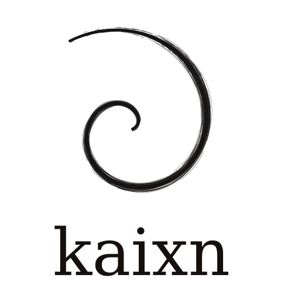

<div align="center">
  
  <p><i>Review the decision, not the diff.</i></p>
</div>

kaixn moves code review **up the stack** for everyone who touches a codebase.
Today PMs write specs disconnected from the system's truth, and engineers review
agent-generated *code* line by line — the wrong altitude in a world where agents
write the code. kaixn owns a **living constitution** of a team's engineering
principles, decisions, and patterns, and surfaces it at the two moments that
matter:

- **PMs** write intent → kaixn shows the **engineering blast radius** and the
  *gaps* (the paths they didn't know) before any code is written.
- **Engineers** review the **constitutional delta a PR implies** — which patterns
  it introduces or evolves, and what it leaves incomplete — instead of the diff.
- **Agents** read the constitution to know what to follow, and feed learnings back.

Three first-class users: **PM, EM, and agents.**

## Rigor for free

The constitution isn't something you author from scratch. kaixn ships a
**pre-built, industry-standard catalog of engineering axes** — point it at any
repo and it inherits that rigor immediately. The codified concepts are what we
bring to the table: *you don't define them — they're industry standard.*

We play **above the language layer**. Naming, formatting, type-hints, lint rules
are table stakes that coding agents and linters already own. kaixn governs the
**design & architecture** tier — the concepts that were *designed*:

| Tier | Examples | Owner |
|---|---|---|
| **Architecture & design (the moat)** | layering, seams, dependency-injection, error-architecture, data-access patterns, concurrency model, state-management, idempotency, trust boundaries, domain patterns (e.g. LLM-output validation) | **kaixn** |
| **Engineering discipline** | commit/PR hygiene, review etiquette, testing strategy, docs, security practices | kaixn |
| **Language / lint** | naming, formatting, type-hints, ruff/mypy | coding agents + linters |

## How it works — the axis model

A **convention is a low-variance choice along an axis** — a dimension along which
code *could* vary but consistently doesn't. We seed the *axes* (the dimensions a
senior reviewer checks); the code reveals the *value*. Two orthogonal properties:

- **Tier** — *advisory* (a regularity the code already exhibits → mined, agent-applied,
  no gate) vs *governed* (a commitment that constrains future code → human-ratified,
  conflict-gated, append-only).
- **Enforcement** — how a violation is mechanically caught: `mypy` · `ruff` ·
  `custom-check` · `test` · `human`. An "invariant" that only a human can catch is
  a *convention in practice*. **Invariants compile to the per-PR gate; the LLM is
  reserved for genuine judgment.**

Two levels of memory: a **global axis registry** (what to look for, grows across
every repo) and **per-repo norms** (this repo's observed/ratified value on each
axis = its handbook).

## Status

**Built & runnable — the v0.2 engine** (`src/kaixn/`): tiered constitution store
(Postgres + pgvector + ltree), typed Proposal/operation model, conflict engine
(consistent / conflict / tension / **gap**), write gate, resolution + supersede
chains, code grounding, drift review, bootstrap, and an MCP + FastAPI surface.

**Designed & validated — the engineering handbook** (the active build): the axis
model, a **168-axis catalog** (`docs/axis-catalog.yaml`), and an eval harness
(`evals/`, run as Claude Workflows) that:
- critiques the catalog (LLM-as-judge),
- measures coverage against a repo's PR review comments **and** its written
  guidelines (the Linux kernel run took baseline coverage from 23% → curated),
- and produces a repo's **architecture playbook for free** — see
  [`docs/playbooks/encode-starlette.md`](docs/playbooks/encode-starlette.md),
  generated from source with zero team-authored standards.

Next: the deterministic + propose/verify **miner**, the **per-PR gate**, and the
**PM editor**.

## Run the engine (web UI, end to end)

A FastAPI app where you paste a **GitHub URL**, mine its docs into a draft
constitution, write an intent, review the synthesized **Proposal** + conflict
report, commit it, and run a drift review — the whole loop in the browser.

```bash
cp .env.example .env          # optionally add ANTHROPIC_API_KEY / OPENAI_API_KEY
docker compose up --build     # web + pgvector Postgres
open http://localhost:8000
```

With no API keys it runs in deterministic **offline mode** (fake embedder +
structural checks). Add `ANTHROPIC_API_KEY` for LLM synthesis/adjudication, and
set `KAIXN_EMBEDDER=openai` (+ `OPENAI_API_KEY`) for real semantic retrieval.

**Without Docker** (in-memory store, no DB): `pip install -e '.[web]' && kaixn-web`.
Point at your own Postgres via `KAIXN_DSN` +
`python scripts/apply_migrations.py "$KAIXN_DSN"`. **Deploy to AWS:** ECS Fargate +
ALB + RDS in one stack — see [`deploy/README.md`](deploy/README.md).

HTTP API: `GET /api/status` · `POST /api/connect {repo_url}` · `GET /api/norms` ·
`POST /api/norms/{id}/promote` · `POST /api/proposals {intent}` ·
`POST /api/proposals/{id}/resolve|commit|review`. Interactive docs at `/docs`.

## Docs

- [`docs/prd.md`](docs/prd.md) — product requirements (three surfaces, tiered trust, the full loop).
- [`docs/tech-spec.md`](docs/tech-spec.md) — flow-level technical design + sequence diagrams.
- [`docs/engineering-handbook-design.md`](docs/engineering-handbook-design.md) — the axis model, sourcing, enforcement, storage. **Start here for the handbook.**
- [`docs/axis-catalog.yaml`](docs/axis-catalog.yaml) — the seed axis registry (what to look for).
- [`docs/engineering-playbook.md`](docs/engineering-playbook.md) · [`docs/playbooks/`](docs/playbooks/) — generated playbooks.
- [`docs/build-plan.md`](docs/build-plan.md) — sequencing (Handbook → per-PR gate → PM editor → agents).
- [`docs/architecture.md`](docs/architecture.md) — the v0.2 engine spec · [`docs/bootstrap.md`](docs/bootstrap.md) — constitution mining.
- `migrations/001_init.sql` · `queries/read_paths.sql` — canonical data model + the read paths it serves.

## Design principles

- **Atomic records** — one claim per norm, one change per operation; checkable.
- **No write-only memory** — every record sits on a defined read path.
- **Append-only** — supersede, never mutate; the timeline stays queryable.
- **Enforcement honesty** — a norm is only an *invariant* if a linter/type-checker/test
  catches a violation; otherwise it's a *convention*, labelled as such.
- **The catalog is the product** — pre-built industry rigor that compounds: every
  repo mined teaches it new design patterns.
