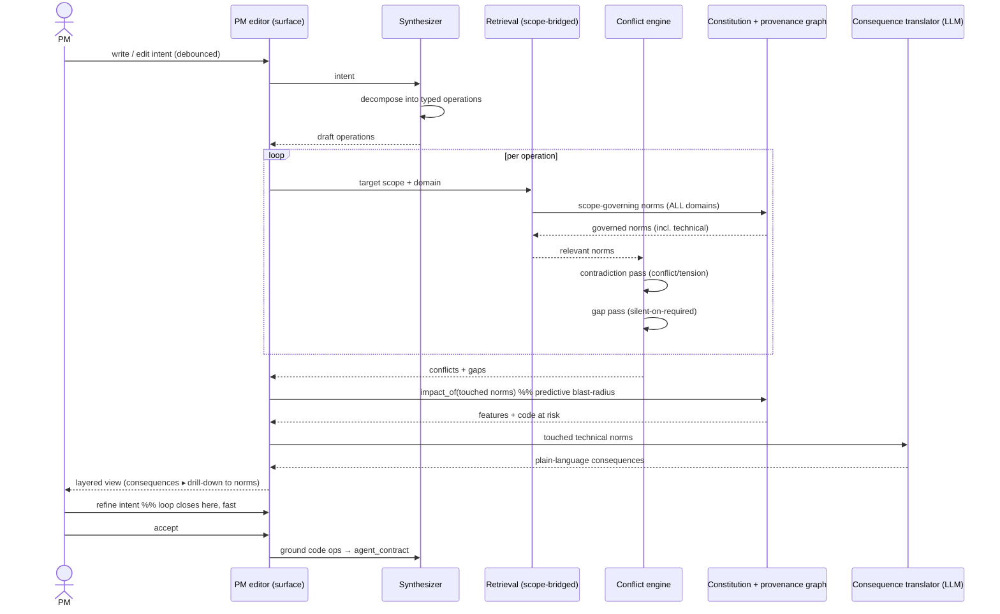
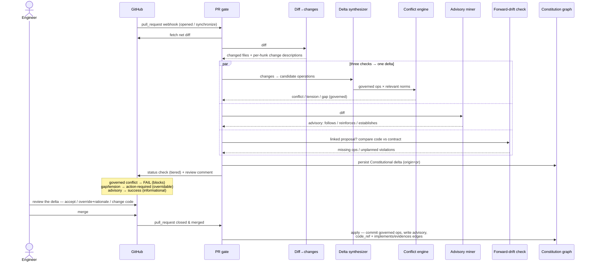
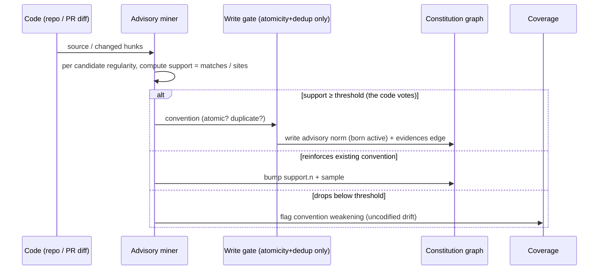
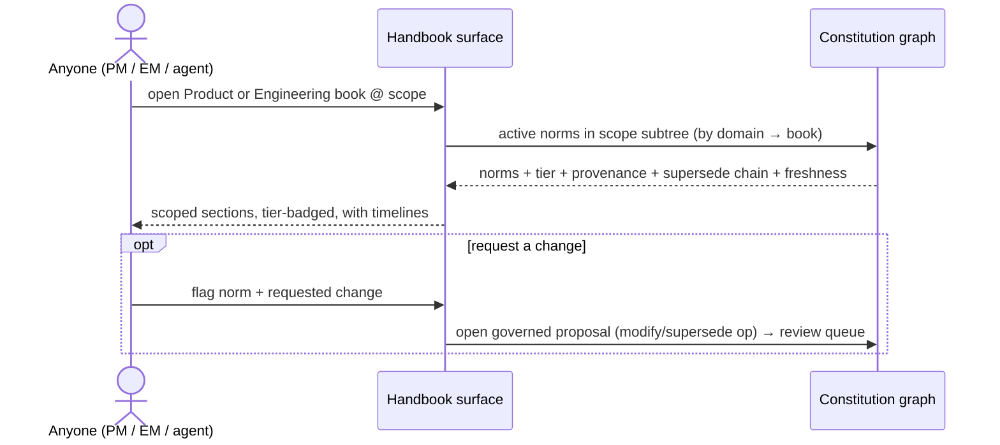
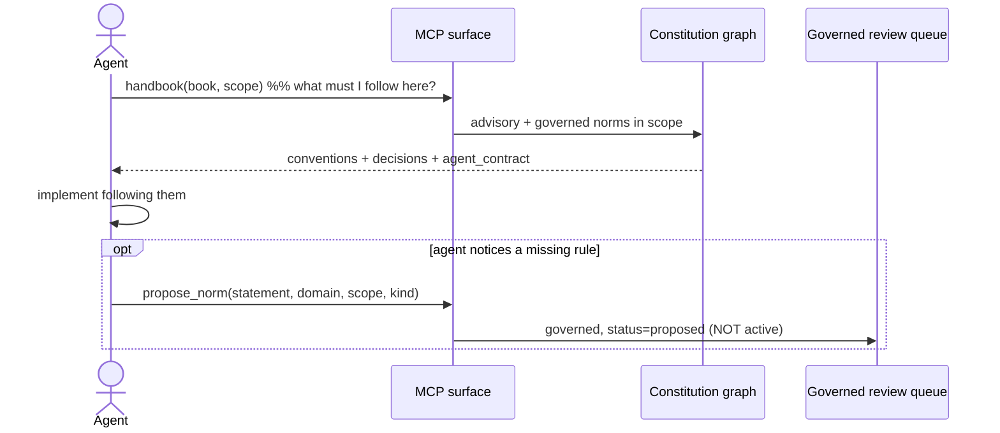
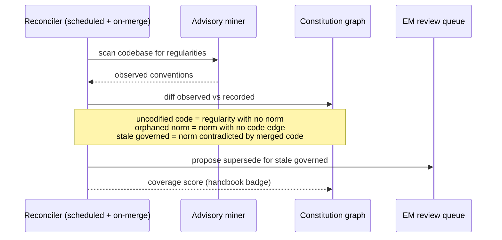

# kaixn — Technical Design (v1)

**Status:** draft · **Owner:** anupreet · **Date:** 2026-06-12
**Implements:** `docs/prd.md` · **Builds on:** `docs/architecture.md` (v0.2)
**Altitude:** concepts & technical flows — *what moves through the system and
why*, not function-level code. Sequence diagrams are the spine.

---

## 1. Core concepts

Everything in kaixn is built from six concepts. Get these right and the flows
follow.

| Concept | What it is | Why it exists |
|---|---|---|
| **Norm** | one atomic, checkable claim about the product or the code | the unit of truth the whole system reads/writes |
| **Kind** | `principle` (durable, hard-stop) vs `decision` (specific, revisable) | severity — a principle conflict blocks; a decision conflict is legitimate evolution |
| **Tier** | `advisory` (observed) vs `governed` (intended) | the trust axis — who/what may change it, and whether a human gates it |
| **Operation** | one typed change-against-state (`assert`/`modify`/`supersede`/`deprecate`/`implement`) | makes change explicit and conflict-checkable; never authored by hand |
| **Proposal** | an ordered set of operations + the intent/diff it came from | the reviewable artifact; the edge-bearer for provenance |
| **Constitutional delta** | the set of norm/coverage changes a *PR* implies | what an engineer reviews instead of the diff |

### 1.1 The tier concept (the v1 heart)

```
            DESCRIPTIVE                              PRESCRIPTIVE
   "a regularity the code already exhibits"   "a commitment constraining future code"
                │                                          │
                ▼                                          ▼
          ADVISORY tier                              GOVERNED tier
   • mined from code (the code votes)         • asserted from intent / proposed
   • born active, no human gate               • human-ratified, conflict-gated
   • agents apply directly                    • append-only, supersede chains
   • never blocks a PR                        • can hard-block a PR (principles)
   • cheap to be wrong, self-correcting       • expensive to be wrong
```

The boundary is **observed vs intended**, not stakes. "Migrate to snake_case but
the code isn't there yet" is *intended* → governed, even though it's stylistically
trivial. This single distinction decides the trust model, the mining strategy, and
the PR enforcement policy.

### 1.2 Two flows, one engine

```
 FLOW A (intent-down, PM)            FLOW B (code-up, EM)
 intent ─▶ Proposal ─▶ contract      diff ─▶ Constitutional delta ─▶ review
        check BEFORE code                    check AT the PR
                   \                        /
                    ▼                      ▼
              ┌──────────────────────────────────┐
              │  ONE conflict engine + ONE        │
              │  tiered constitution (norms)      │
              │  read by PM, EM, and agents       │
              └──────────────────────────────────┘
```

A Proposal is the shared artifact: Flow A synthesizes it from *intent*, Flow B
synthesizes it from a *diff*. Same operation model, same engine, two trigger
moments.

---

## 2. Logical components

Responsibilities, not modules. (Repo modules that seed each are noted for
traceability.)

| Component | Responsibility | Seeds |
|---|---|---|
| **Constitution store** | hold tiered norms + provenance graph; serve the read paths | store / migrations |
| **Retrieval** | given a target scope, return the norms that govern it — *across domains* | store.neighbors / read_paths |
| **Synthesizer** | intent **or** diff → typed operations | engine / (new diff-synth) |
| **Conflict engine** | adjudicate operation × norm → consistent/conflict/tension/**gap** | conflict |
| **Advisory miner** | detect code regularities above a consistency threshold → advisory norms | codebase |
| **Write gate** | atomicity + dedup + consistency before any governed write | gate |
| **Resolution** | apply accepted ops; supersede chains; record provenance edges | resolution |
| **PR gate** | diff → delta → tiered check + comment → apply on merge | review (seed) |
| **Reconciler** | standing coverage: uncodified code, orphaned norms, stale governed | review (seed) |
| **Surfaces** | PM editor, Handbook, PR review view, MCP for agents | web / server |

---

## 3. Flow A — PM living-PRD editor (intent → impact, before code)

**Concept:** the PM never authors operations or reads raw eng norms. They write
intent; kaixn continuously grounds it against the constitution and shows
**conflicts, gaps, and blast-radius** — in product language. "Comprehensive
requirements" stops being an N-iteration human discovery and becomes a live signal.



**The load-bearing design point (Q7):** retrieval must be **scope-bridged across
domains**. Today retrieval is domain-siloed, so a *product* concept never surfaces
*technical* norms — which is the whole value of this surface. The scope tree
(`all.product.billing.*`) is the bridge: a product concept pulls the technical
norms that govern the same product area. The gap pass is already cross-domain; the
contradiction pass becomes so here.

**State of the artifact:** intent → draft Proposal (`origin=intent`) → on accept,
governed ops are committed and code ops grounded into an `agent_contract` the agent
implements. That contract is the hand-off into Flow B.

---

## 4. Flow B — the per-PR constitutional gate (keystone)

**Concept:** instead of reviewing the diff, the engineer reviews the
**constitutional delta** the PR implies. Because the review rides on the commit,
the constitution can never silently drift from code. A clean PR sails through;
engineers stop only where a pattern **conflicts** or must **evolve**.



**Three checks, one delta:**
1. **vs the proposal** it claims to implement (forward-drift) — did the agent honor
   the `agent_contract`?
2. **vs governed norms** — conflict / gap / tension; a pattern that *evolves*
   becomes a `supersede`/`modify` operation in the delta.
3. **vs advisory conventions** — follows / reinforces / **establishes a new
   regularity** worth recording.

**Tiered enforcement** (the concept that makes engineers trust it):

```
   governed conflict vs PRINCIPLE   ──▶  ✗ required check FAILS (hard block)
   governed gap / tension           ──▶  ⚠ action-required (override w/ rationale)
   forward-drift (missing/violation)──▶  ⚠ action-required
   advisory (new/changed convention)──▶  ✓ informational, never blocks
```

Overrides carry a rationale → recorded as a verdict → **eval data** (the system
learns from every human decision). The **sync guarantee** is the merge step: every
merge applies the delta, so code and constitution move together by construction.

**Two entry modes converge here:** an *agent-authored* PR (proposal known → fast
"did it honor the contract") and a *human-authored* PR (delta inferred cold).

---

## 5. Advisory mining flow (continuous learning, no gate)

**Concept:** advisory norms are *descriptions of what the code already does*, so the
code is the evidence — no human approval is needed. They're mined at bootstrap and
**re-derived on every PR**, keeping the handbook a live mirror of conventions.



**Why no conflict adjudication:** advisory norms aren't changes-against-state —
they're observations. They never enter the conflict engine and never block. The
only quality bar is the **consistency threshold** (the anti-noise knob) plus
atomicity/dedup so the store stays clean. A *prescriptive* change to a convention
(team wants a new style not yet in the code) is not advisory — it goes governed.

---

## 6. Handbook read flow (anyone) + flag-to-propose

**Concept:** the handbook is the always-current read surface — two books that
"roughly represent what the codebase is." It is read-only (append-only invariant),
but anyone can *flag* an entry, which opens a governed proposal.



- **Product book** = `product` + `product_design` + `ux`; **Engineering book** =
  `technical`. Sections follow the **scope tree** (billing, auth, …).
- Each entry shows **tier badge** (observed-convention vs ratified-principle/decision),
  **provenance** (source commit/proposal), **supersede timeline** (pattern
  evolution), **freshness** ("synced to commit X").

---

## 7. Agent flow (consume + gated propose, via MCP)

**Concept:** agents are a first-class user — they *read* the patterns/style/decisions
to follow, and may *propose* (never silently write) governed norms. Advisory they
only consume; they don't self-certify conventions.



The agent's *code* still returns through the PR gate (Flow B), so anything it
introduces is reviewed there — `propose_norm` is for explicit knowledge, not a
backdoor around the gate.

---

## 8. Reconciler — coverage (backstop + handbook health)

**Concept:** per-PR review keeps things synced going forward; the reconciler is the
standing check that nothing slipped, and the number that tells you how honest the
handbook is.



`coverage` (handbook-vs-code) and `gap` (per-change) are the **two completeness
notions** the PRD separates: different engines (reconciler vs conflict engine), one
shared store.

---

## 9. State machines

### 9.1 Norm lifecycle (by tier)

```
ADVISORY:    (mined) ──▶ active ──▶ weakening ──▶ deprecated
                          ▲   │
                          └───┘  support re-confirmed each PR

GOVERNED:    proposed ──ratify──▶ active ──supersede──▶ superseded
                 │                   │
              (reject)            deprecate ──▶ deprecated
```

Advisory is born `active` (the code is its evidence); governed must be `ratify`-ed
by the domain owner (PM for product domains, EM for `technical`; principles take a
higher bar).

### 9.2 Operation status (within a Proposal)

```
 proposed ─structural-check─▶ {conflict | needs_grounding | proposed}
 proposed ─conflict-engine─▶ accepted ─commit/merge─▶ applied
                              │
                              └─ rejected
```

### 9.3 PR check state (Flow B)

```
 analyzing ─▶ { passed | action_required | failed }
                  │            │              │
              (advisory)  (gap/tension/    (governed conflict
                           drift, override   vs principle)
                           w/ rationale)
                  └──────────── merged ─▶ applied (constitution updated)
```

---

## 10. Cross-cutting design

- **Offline determinism.** Every component has a no-LLM fallback (heuristic miner,
  naive synthesizer, pass-through adjudicator) so the system runs and tests with no
  keys. Concept: the *structure* (typing, scope, tiers, gate) is deterministic; the
  LLM only adjudicates semantics.
- **Append-only.** Nothing mutates except advisory `support` counters. A changed
  convention = new advisory norm + weakening of the old; a changed decision =
  supersede. History stays queryable.
- **Idempotency.** PR analysis is keyed by `(repo, pr, head_sha)`; webhook
  re-delivery updates the same delta in place.
- **Latency.** Structural + retrieval are sub-second; LLM adjudication fans out per
  (change × norm). The PR gate targets a full delta well inside a normal CI window.
- **Trust boundary.** Webhook signatures verified; repo fetch is a remote boundary
  (strict URL validation); GitHub App least-privilege (read contents, write
  checks + PR comments).

---

## 11. What's net-new vs reused (traceability, not code)

**Reused as-is or lightly extended:** constitution store + provenance graph, the
typed operation model, the conflict engine (contradiction + gap), the write gate,
resolution/supersede mechanics, code grounding, doc/code extraction, MCP scaffold,
the offline fallbacks.

**Net-new concepts to build:**
1. **Tier** on norms + the **advisory lane** (mine → born-active, no gate).
2. **Scope-bridged cross-domain retrieval** (unlocks the PM blast-radius).
3. **Diff → constitutional-delta synthesis** (Flow B's reverse of intent synthesis).
4. **PR gate**: webhook → delta → tiered check + comment → apply-on-merge.
5. **Handbook** read surface (two books) + flag-to-propose.
6. **Coverage reconciler** (uncodified / orphaned / stale).
7. **Per-surface evals** (synthesis, per-PR delta, advisory precision).

---

## 12. Build sequence (flows, not files)

1. **Tiered constitution + Handbook** — make the asset real and visible (tier,
   advisory miner, handbook read). *Flow 5 + 6.*
2. **Per-PR gate** — the keystone EM value + the sync guarantee. *Flow 4.*
3. **PM editor** — scope-bridged retrieval + predictive impact. *Flow 3.*
4. **Agents + authority** — MCP read/propose, ratify policy. *Flow 7.*
5. **Reconciler + coverage** — backstop + health, connectors. *Flow 8.*

Each ships its eval slice first — the engine is the product and cannot ship on vibes.
